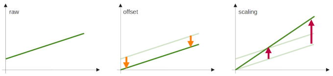

# Sensor Module

The sensor module receives sensor data from the user script and processes it. It handles averaging, offset, scaling, and Tare. It publishes the live data to serial, to WebSocket, and MQTT. Stored recent data can be downloaded as CSV.

## Contents

<!-- vscode-markdown-toc -->
* [Contents](#Contents)
* [Getting Started](#GettingStarted)
	* [First Steps](#FirstSteps)
	* [Web Interface](#WebInterface)
* [Example Scripts](#ExampleScripts)
	* [Dummy Sensors for Testing](#DummySensorsforTesting)
	* [Real Sensor Breakouts](#RealSensorBreakouts)
* [Custom Implementation](#CustomImplementation)
	* [General Functionality](#GeneralFunctionality)
	* [Options](#Options)
* [Data Handling Details](#DataHandlingDetails)
	* [Sample-to-Int Exponent](#Sample-to-IntExponent)
	* [Offset, Scaling, Tare](#OffsetScalingTare)
* [Troubleshooting](#Troubleshooting)
* [License](#License)

<!-- vscode-markdown-toc-config
	numbering=false
	autoSave=true
	/vscode-markdown-toc-config -->
<!-- /vscode-markdown-toc -->

## Getting Started

### First Steps

The [magnitude.ino](/examples/sensor/magnitude/magnitude.ino) example is a good choice to get started. It is not a real sensor so you do not need any hardware. Compile a copy of the sketch and listen to the serial port using your IDE (baud rate: 115200).

Use the [WebSocket sensor example](/examples/websocket/websocket_sensor.html) or the [MQTT sensor example](/examples/mqtt/mqtt_sensor.html) to display the sensor data in a browser or store it in a remote database. Both allow to the end-user to set/clear [tare](#offset-scaling-tare) and thus 'zero' the current values.

To use WebSockets obviously the receiving device needs to be able to reach the ESP device over the network.

To use MQTT obviously both the ESP device and the receiving device need to be able to access the MQTT broker. Make sure the correct URL/IP is set in the web interface of the ESP and in the browser. For testing purposes one can use the public *test.mosquitto.org* broker.

### Web Interface

 *  Set how many individual measurements should be averaged before being reported.
 *  Set the number of measurements to average for offset and scaling measurement
 *  Set a minimum wait time to wait between accepting new measurement data.
 *  Data interface and download.
 *  Start offset and scaling measurements.
 *  Reset offset and scaling.

## Example Scripts

### Dummy Sensors for Testing

The dummy sensor scripts generate 'data'. They can be used for testing evaluation scripts and developing display options.

 *  [magnitude.ino](/examples/sensor/magnitude/magnitude.ino): Outputs sensor 'data' with values of vastly different orders of magnitude.
 *  [matrix.ino](/examples/sensor/matrix/matrix.ino): Outputs sensor 'data' of a typical matrix-sensor with somewhat similar values for all pixels. 
 *  [noise.ino](/examples/sensor/noise/noise.ino): The generated 'data' has more or less deterministic noise patterns. It can be used to better understand the noisy output of a real sensor. 

### Real Sensor Breakouts

The real world examples are demonstrating implementations only. Please know what you do before using the data output.

 *  [BME680](/examples/sensor/bme680/bme680.ino): Environmental sensor measuring temperature, humidity, pressure, and air resistance.
 *  HX711 load cell amplifier: weight. (planned)

## Custom Implementation

Please also see the documentation of the framework regarding [custom implementation](/README.md#custom-implementation).

### General Functionality

The sensor module is initialized with the number of values the sensor measures simultaneously/within one cycle. Also a local data array is created, of a numeric type such as `int32_t *` or `float_t *`.

    const uint8_t valueCount = 2;
    XmoduleSensor xmoduleSensor(valueCount);

    int32_t data[valueCount];

The sensor object is passed to the framework during setup. This needs to be done before initializing the framework.

    mvp.addXmodule(&xmoduleSensor);

Read-out of the sensor needs to be done by the user in custom code. The data, if available, is passed to the framework as an array 

    xmoduleSensor.addSample(data);

### Options

A description of the sensor and its measurement units can be added for identification. Some special characters need to be encoded:

 *  Degree ° is non-ASCII, use `&deg;`
 *  The percent symbol % is used as deliminator by the string parser, use `&percnt;`  

For a typical sensor:

    xmoduleSensor.setSensorInfo("EnvSensor", "Environmental data: temperature, rel. humidity", {"T", "rH"}, {"&deg;C", "&percnt;"});

For a matrix sensor the column count is set to allow formatted CSV output: -> a1,a2,a3,a4;b1,b2,b3,b4;c1,c2,c3,c4; -> a1, [...].

    const uint8_t columns = 4;
    xmoduleSensor.setSensorInfo("Matrix", "A pixel array with the size 4x3.", "pixel", "counts", columns);

Shift the decimal point of the sample values by the given exponent, see section [Sample-to-Int Exponent](#sample-to-int-exponent) for more information. Also see the [BME680](/examples/sensor/bme680/bme680.ino) example for a use case.

    int8_t exponent[valueCount] = {-1, 2};
    xmoduleSensor.setSampleToIntExponent(exponent);

The number of measurements stored is limited by the available memory on the ESP. Data collection can be set to adaptive mode, growing depending on available memory. If turned on this feature could lead to stability issues, depending on other operations and memory fragmentation.

    xmoduleSensor.setDataCollectionAdaptive();

## Data Handling Details

### Sample-to-Int Exponent

Data handling within the MVP3000 framework is done as integer. When working with floats/decimal raw data or when rounding after averaging it is important to maintain sufficient significant digits. This is done by shifting the decimal point of the raw value *x* using an exponent *n* multiplier to yield the decimal-shifted value *x' = x \* 10n*. This value *x'* is stored, averaged, and scaled by the sensor module, and reported. The following table shows the 'encoding' step on the ESP.

|           | Raw value | Exponent  | Multiplicator | Reported int              |
| ---       | ---       | ---       | ---           | ---                       |
|           | x         | n         | 10n| x' = x * 10n   |
| Sensor A  | 12345     | -1        | 0.1           | 1235                      |
| Sensor B  | 54.321    | 2         | 100           | 5432                      |

In order to retrieve the original value for display or data analysis, the decimal shift of the reported value needs to be reversed. This is done using the inverse exponent *-n* multiplier to yield the decimal-un-shifted value *x" = x' \* 10-n*. The following table shows the 'decoding' step on the computer.

|           | Received int  | Inv. Exp. | Multiplicator     | Reported value            | Sign. digits  |
| ---       | ---           | ---       | ---               | ---                       | ---           |
|           | x             | n         | 10-n   | x" = x' * 10-n |               |
| Sensor A  | 1235          | 1         | 10                | 12350                     | 4 \*          |
| Sensor B  | 5432          | -2        | 0.01              | 54.32                     | 4             |

*\* Note the rounded value of the 4th significant digit.*

### Offset, Scaling, Tare

Many sensors are already calibrated during fabrication. However, sensor response often shifts over time and can be quite different even for two identical sensors. Best practice:
 *  Regularly recalibrate all sensors.
 *  Calibrate the sensors at values close to the intended measurement range.
 *  Cover at least the whole intended measurement range, no extrapolation.

**Offset** defines the current measurement value as zero. It essentially shifts all values vertically by an equal distance. Typically this is the lower end of the intended measurement range.

**Scaling** stretches the current measurement to a given value. Typically this is the upper end of the intended measurement range.

**Tare** is a second offset, see [Wikipedia](https://en.wikipedia.org/wiki/Tare_weight). It offers a quick way to zero the current value without permanently changing the measured offset and scaling. It can be used to remove any small and slow drift of the sensor, for example caused by a change of environmental temperature.

NOTE (obvious): Scaling in the MVP3000 framework is done linearly. The data coming from the sensor needs to be of (more or less) linear nature. This is very often the case already. However sometimes a different slope is a better representation of the real world and used instead. One example are the *1/x* inverse conductance and resistivity. In this case the measurements need to be inverted/linearized before passing them to the framework to use the scaling feature. 

## Troubleshooting

See also [Troubleshooting](/README.md#troubleshooting) of the whole framework.

Q: The raw sensor values are fine, but the averaged values reported by the framework are zero/strange?  
A: Check offset and scaling via the web interface. Look for extremely large values and for scaling additionally for values close to zero. Make sure Tare is cleared (a restart would do this). Possibly factory reset the device.

Q: The reported values are still strange?  
A: Check if there is a conversion of data types that does not work as intended.

## License

Licensed under the Apache License. See [LICENSE](/LICENSE) for more information.

Copyright Production 3000
